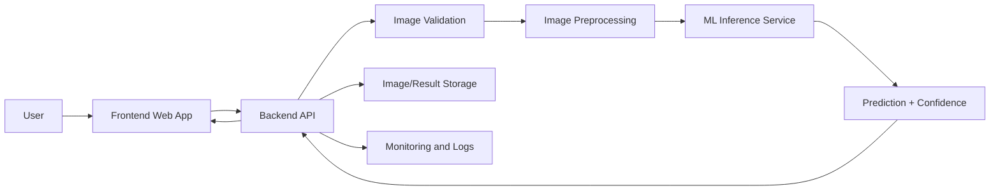
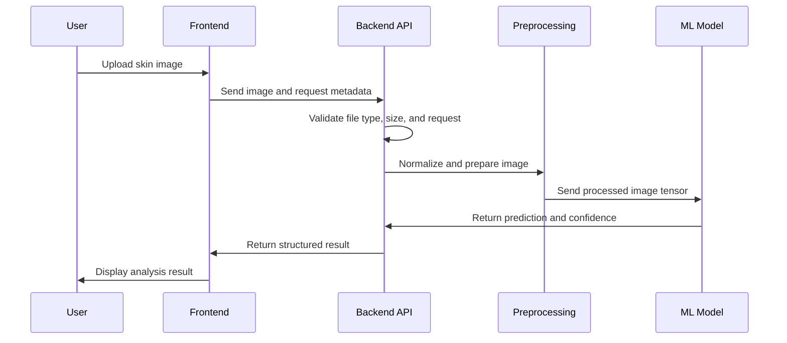

# DermaVision

DermaVision is a proposed dermatology image-analysis application for uploading skin images, preprocessing them, running an AI-based disease prediction workflow, and showing users a structured result with confidence information and next-step guidance.

> Note: this repository copy currently contains project metadata only. Application source files should be added under the appropriate frontend, backend, and model folders before production use.

## Project Goals

- Accept skin lesion or dermatology images from users.
- Validate and preprocess images before model inference.
- Run a trained machine learning model for skin condition classification.
- Return prediction results with confidence scores.
- Keep the system modular so the frontend, backend API, and ML model can evolve independently.

## High-Level Design



## Workflow



## Suggested Repository Structure

```text
dermavision/
  frontend/          # Web UI
  backend/           # API server
  models/            # Trained model artifacts or loaders
  notebooks/         # Training and experimentation notebooks
  docs/              # Architecture and project documentation
  README.md
```

## Recommended Tech Stack

- Frontend: React or another modern web UI framework.
- Backend: Python FastAPI or Flask for image upload and inference APIs.
- ML: TensorFlow, Keras, or PyTorch for image classification.
- Storage: Local filesystem during development; object storage for production.

## Local Development

After adding application source code, a typical local workflow should look like this:

```bash
# frontend
cd frontend
npm install
npm start

# backend
cd backend
python -m venv .venv
pip install -r requirements.txt
python app.py
```

## Important Notes

- Do not commit dependency folders such as `node_modules`.
- Do not commit virtual environments, temporary files, generated caches, or secrets.
- Medical prediction output should be treated as assistive information only and should not replace professional medical diagnosis.

## Future Enhancements

- Add authentication and user history.
- Add explainability visualizations such as heatmaps.
- Add doctor review or report export.
- Add automated testing and CI/CD workflows.
- Add deployment configuration for cloud hosting.
